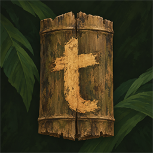
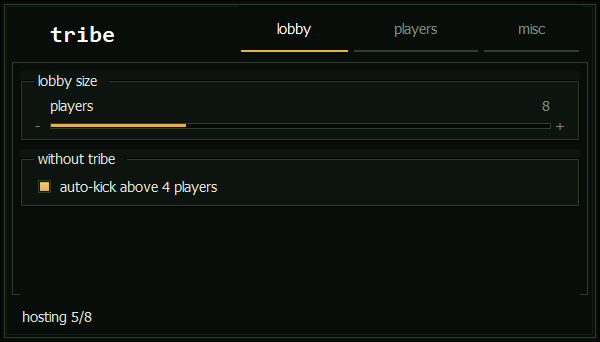
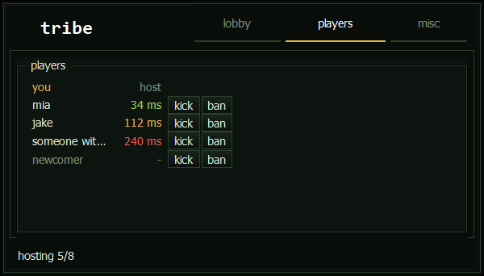

<p align="center"></p>
<h1 align="center">tribe</h1>
<p align="center">
  A small tool for Green Hell co-op.<br>
  It lifts the four-player lobby limit (up to 16) and adds a player list with pings, kick and ban.
</p>

<p align="center">
  
  &nbsp;
  
</p>

## Using it

1. Start Green Hell.
2. Run `tribe.exe`. A line in the game confirms the patch.
3. Host or join as usual.

Everyone in a lobby larger than four needs tribe. Run it each time you start Green Hell; the patch lasts until the game closes.

Released builds are a single `tribe.exe`; the game-side patch module is embedded, so there is no separate DLL to install or update.

**End** shows and hides the menu (you can change the key on the misc tab), and the game frees your mouse while
it's open. The menu appears on the taskbar while shown. Hiding or minimizing it leaves the tray icon; click that
icon to show or hide the menu, or right-click for **unload**. Running `tribe.exe` again also brings it back.
**unload** closes tribe; the patch itself stays until you quit the game.

### If you host

- **Lobby size** (5 to 16). It applies to a lobby that's already open, so you can raise it when more people turn up.
  It won't go below the number of players already in.
- **Players**: everyone in the lobby with their ping to you, and kick and ban buttons (two clicks each).
- **Auto-kick** (on by default): see below.
- **Banned** list on the misc tab, with unban. Bans are stored on your PC and only apply to lobbies you host.

### If you join

You get the player list with pings and nothing else. Lobby size, kick and ban belong to the host.

### Players without tribe

A game without the patch only breaks when the lobby goes above four players. So:

- With four or fewer players, nobody is kicked. The lobby is held at four until they patch or leave, then goes back
  to your chosen size by itself.
- If someone without tribe ends up in a lobby of five or more, tribe waits about 10 seconds, posts a line in the game chat
  saying why, and kicks them. Turn auto-kick off if you'd rather decide yourself; the lobby is then held at four.

Steam can't screen players before they enter, so an unpatched player who joins a big lobby will have a broken game
for those few seconds. Tell your friends to run tribe first.

## What it sends

tribe has no server and makes no internet connections of its own.

- **Between its two halves**: `tribe.exe` and the part it loads into the game talk over a local socket on
  `127.0.0.1`. The game side has to present a random token generated for that run before anything is accepted.
- **Ping**: every two seconds each player sends the host a 9-byte packet (a type byte and a timestamp) over the
  Steam connection the game already has open, and the host echoes it. It never opens a connection the game didn't.
- **Lobby tags**: each patched player sets `tribe=1` and their ping in milliseconds as Steam lobby member data, which
  other lobby members can read.
- **Chat**: the one line posted before an auto-kick.

It never reads, stores, logs or displays anyone's IP address. The log (`Documents\Tribe\logs`) holds player names and
what tribe did, and stays on your PC. The ban list (`Documents\Tribe\settings.xml`) holds Steam IDs and names.

Note that Green Hell's co-op is peer-to-peer through Steam. That is how the game works with or without tribe.

## Under the hood

<details>
<summary><b>Why everyone needs it</b></summary>

The limit is a single number in the game (`P2PSession.MAX_PLAYERS`), which the host passes to Steam when the lobby
is created. But three lists in the game are sized from it, and they overflow on every player's machine as soon as a
fifth player is present:

| list | size | what it holds |
|---|---|---|
| `AIManager.s_PlayerPositionsHolder` | 4 | every player's position, refilled on each AI update |
| `ReplicationComponent.s_SendToPeers.peers` | 4 | the other players a network update goes to |
| `HUDCoopPlayers.m_Elements` | 3 | the name and health tags over other players |

tribe enlarges all three to 16 and then raises the limit. How many players can actually join is the Steam lobby's
member limit, which the host's copy keeps at the chosen size.

16 is a number I picked, not a limit of the game or of Steam. Every player connects directly to every other player,
so the real ceiling is bandwidth and performance, and I don't know yet where that is.

</details>

<details>
<summary><b>How it works</b></summary>

`tribe.exe` loads a small assembly (`core/`) into the game's Mono runtime using Mono's own embedding API. Nothing on
disk is changed and no game code is patched; the changes are the values above, in memory, until the game exits.

- **Kick** calls the game's own host kick, the one behind its pause-menu player list.
- **Ban** is a list tribe keeps; a banned player is kicked when they appear. Neither the game nor Steam lobbies have a
  ban of their own.
- **Ping** is measured by tribe, because the game doesn't measure it.
- While the menu is open, the game's own cursor and input blocks are used, the same ones its inventory and chat use.

</details>

<details>
<summary><b>Building</b></summary>

You need Green Hell installed (the build references its assemblies) and nothing else: it compiles with the C#
compiler that ships with Windows.

```powershell
powershell -File build.ps1                 # bin\tribe.exe, a single file
powershell -File build.ps1 -Game "D:\Games\Green Hell"
.\bin\tribe.exe --render .\bin\render 1    # screenshots of every menu state, no game needed
```

The code is C# 5 on purpose, since that is what the built-in compiler understands.

| path | what |
|---|---|
| `core/Patch.cs` | the patch, lobby upkeep, auto-kick and bans |
| `core/Players.cs` | ping and kick |
| `core/Runner.cs`, `Entry.cs`, `Link.cs`, `MenuHold.cs` | the in-game side: lifecycle, messages, mouse release |
| `app/MainForm.cs`, `Theme.cs`, `Bindings.cs` | the menu |
| `app/Game.cs`, `Injector.cs`, `Link.cs` | finding the game, loading the core, talking to it |

A `tribe.exe` started from `bin\` runs from a temporary copy and restarts itself when you rebuild.

</details>

## Problems

If something breaks, open an issue and attach your log from `Documents\Tribe\logs`.

## Disclaimer

Tribe is an independent community tool and is not affiliated with or endorsed by Creepy Jar.

## License

MIT, see [LICENSE](LICENSE).

